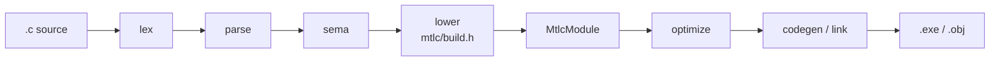
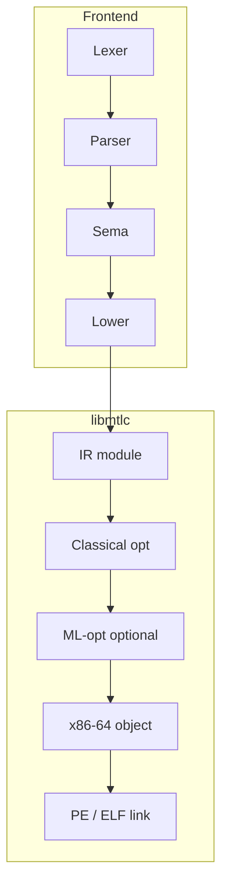
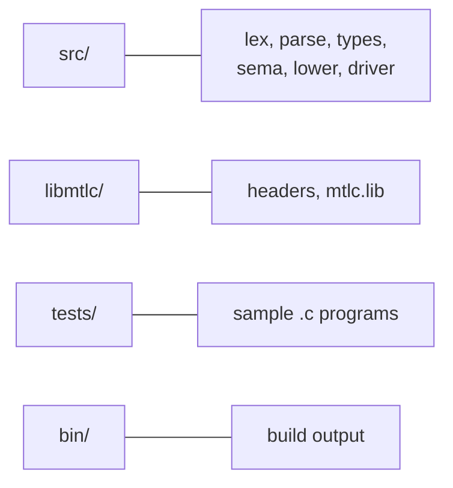
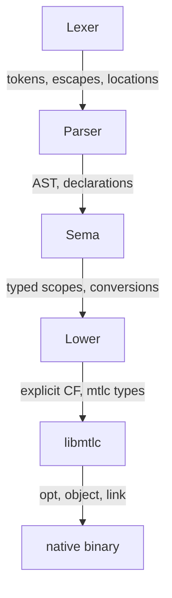

# C99Mettle

A **C99 compiler frontend** that lowers to [libmtlc](libmtlc/), a standalone
native backend (custom IR, classical + ML optimizers, x86-64 / ARM64 / PTX /
SPIR-V codegen, PE linker on Windows).





## Build

**Windows (MinGW):**

```bat
build.bat
```

**Make:**

```bash
make
```

Produces `bin/c99mtlc.exe` (or `bin/c99mtlc`). Requires `libmtlc/lib/mtlc.lib`
and headers under `libmtlc/include/`.

## Usage

```bat
bin\c99mtlc.exe tests\fib.c -o bin\fib.exe
bin\fib.exe
echo %ERRORLEVEL%
```

| Flag | Meaning |
|------|---------|
| `-o path` | Output executable (default `a.exe`) or object with `-c` |
| `-O0` / `-O` | Optimization off / on (libmtlc classical optimizer) |
| `-c` | Emit relocatable object only |
| `--emit-ir` | Lower only (smoke test, no file) |

## Language subset

Implemented with C99-oriented syntax and semantics:

- Types: `void`, `_Bool`, `char`/`short`/`int`/`long`/`long long` (+ unsigned),
  `float`/`double`, pointers, fixed arrays, function types, `struct`/`union`,
  `enum`, `typedef`
- Control: `if`/`else`, `while`, `do`/`while`, `for`, `break`/`continue`,
  `return`, `switch`/`case`/`default` (limited fall-through), `goto`/labels
- Expressions: arithmetic, bitwise, logical short-circuit `&&`/`||`,
  comparisons, assignment and compound assignment, `++`/`--`, casts, `sizeof`,
  calls, subscript, `.` / `->`, ternary, comma
- Declarations: functions (with prototypes), locals, file-scope globals,
  `extern` / `static` (basic), enum constants
- Runtime externs predeclared for linking: `malloc`, `free`, `putchar`,
  `getchar`, `printf` (single-arg shape), `exit`

**Not yet (or only partially):** preprocessor (`#include` / macros are skipped
or ignored), VLAs, bit-fields, `_Complex`, full designated initializers,
variadic `printf` codegen, nested functions, K&R definitions, full switch
fall-through across arbitrary statements.

Arrays are allocated via `malloc` at the point of declaration (backend builder
has no aggregate stack locals). String literals are pooled and filled through
`malloc` on first use.

## Layout



## Pipeline ownership



| Phase | Owns |
|-------|------|
| Lexer | Tokens, escapes, comments; locations |
| Parser | AST, C declaration grammar |
| Sema | Scopes, types, conversions, control-flow context |
| Lower | Explicit control flow, pointer scaling, libmtlc types |
| libmtlc | Optimize, x86-64 object, PE/ELF link |

## License

Project scaffolding for use with libmtlc. See libmtlc for backend licensing.
