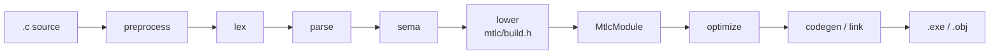
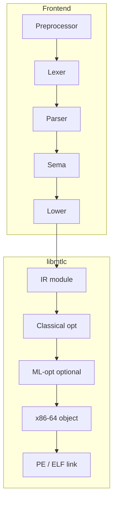
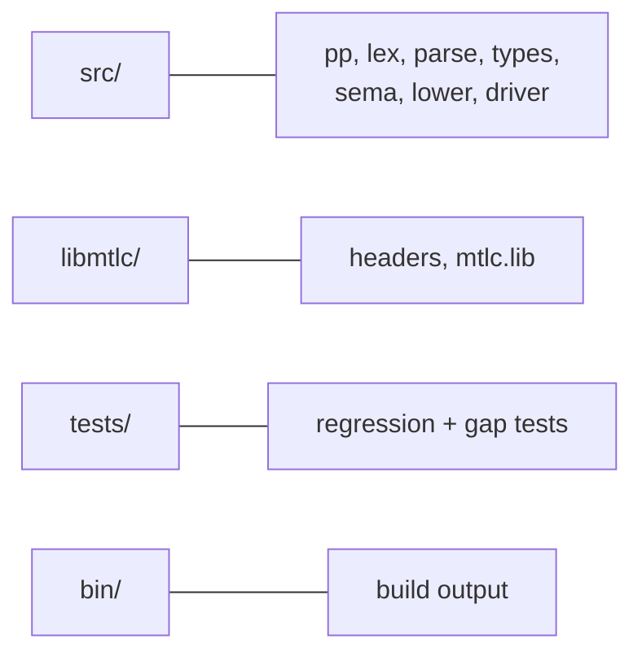

# C99Mettle

A **C99 compiler frontend** that lowers to [libmtlc](libmtlc/), a standalone
native backend (custom IR, classical + ML optimizers, x86-64 / ARM64 / PTX /
SPIR-V codegen, PE linker on Windows).





## Build

**Windows (MinGW):**

```bat
build.bat
```

**Make:**

```bash
make
```

Produces `bin/c99mtlc.exe` (or `bin/c99mtlc`). Requires `libmtlc/lib/mtlc.lib`
and headers under `libmtlc/include/`.

## Usage

```bat
bin\c99mtlc.exe tests\fib.c -o bin\fib.exe
bin\c99mtlc.exe -I tests\include tests\pp_include.c -o bin\out.exe
bin\c99mtlc.exe tests\multifile_a.c tests\multifile_b.c -o bin\mf.exe
bin\c99mtlc.exe -E -I tests\include tests\pp_include.c
```

| Flag | Meaning |
|------|---------|
| `-o path` | Output executable (default `a.exe`) or object with `-c` |
| `-I dir` | Add `#include` search path |
| `-E` | Preprocess only (stdout) |
| `-O0` / `-O` | Optimization off / on (libmtlc classical optimizer) |
| `-c` | Emit relocatable object only |
| `--emit-ir` | Lower only (smoke test, no file) |

## Language (C99-oriented)

- **Preprocessor:** `#include` (quoted/angle), object/function macros, `#` /
  `##`, `#if` / `#ifdef` / `#ifndef` / `#elif` / `#else` / `#endif`,
  `#define` / `#undef` / `#error` / `#line` / `#pragma` (ignored), line splice,
  trigraphs, `-E`, `-I`
- **Types:** scalars, pointers, fixed arrays, VLAs, function types, function
  pointers, `struct` / `union` (incl. bit-fields), `enum`, `typedef`,
  `_Complex` float/double
- **Control:** full `if`/`while`/`do`/`for`, `switch` with fall-through,
  `break`/`continue`/`goto`/labels, `return`
- **Expressions:** arithmetic, bitwise, short-circuit `&&`/`||`, casts,
  `sizeof`, calls (direct + indirect), subscript, `.` / `->`, ternary, comma,
  designated initializers, compound literals
- **Variadics:** user `...` with `__builtin_va_list` / `va_start` / `va_arg` /
  `va_end`; multi-arg packing to callees
- **Multi-file:** several `.c` inputs merged into one module and linked
- **Runtime externs:** `malloc`, `free`, `putchar`, `getchar`, `exit` (and
  user-declared libc such as `printf`)

### Residual backend limits (libmtlc public builder)

- Aggregate locals/arrays/strings are **contiguous allocations** (typically via
  `malloc` / one block per object), not hardware stack slots or PE rodata
  sections. Semantics for indexed access and string content are correct; ABI is
  not identical to MSVC stack arrays.
- No full system C library headers; include your own or minimal project headers.
- Variadic **extern** calls that need a different declared arity than the symbol
  table may require an explicit prototype matching the call (user-defined
  variadics are fully handled).
- Debug info / precise source locations on IR are not attached yet.

## Layout



## Tests

```powershell
powershell -File tests/run_suite.ps1
```

Covers fib/hello/arith/loop plus preprocessor, designated init, switch
fall-through, function pointers, variadics, arrays/strings, bit-fields,
`_Complex`, VLAs, and multi-file link.

## Pipeline ownership

| Phase | Owns |
|-------|------|
| Preprocess | Macros, includes, conditionals |
| Lexer | Tokens, escapes, comments; locations |
| Parser | AST, C declaration grammar |
| Sema | Scopes, types, conversions, control-flow context |
| Lower | Explicit control flow, pointer scaling, libmtlc types |
| libmtlc | Optimize, x86-64 object, PE/ELF link |

## License

Project scaffolding for use with libmtlc. See libmtlc for backend licensing.
